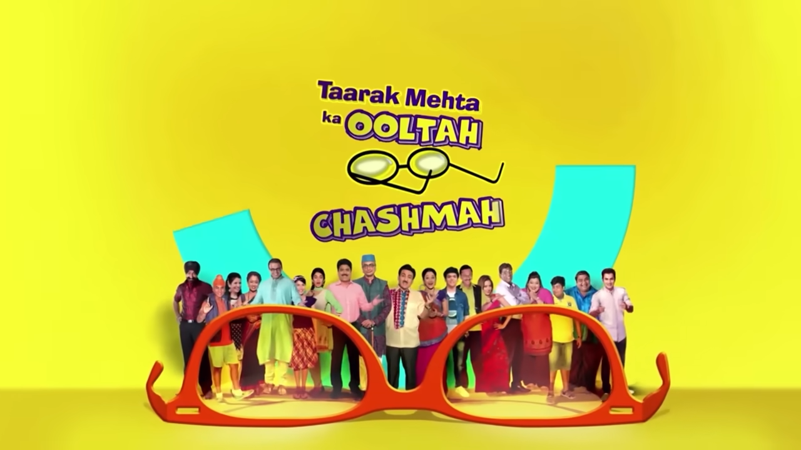
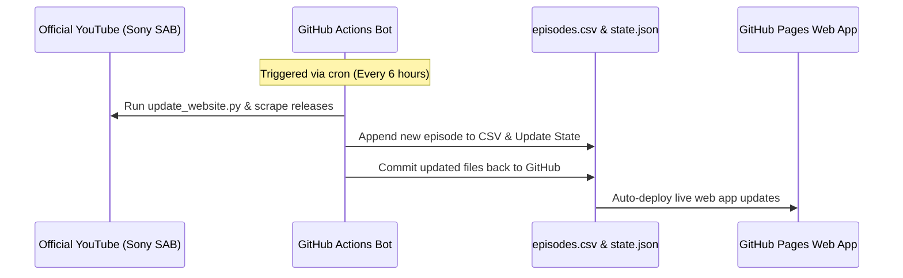

<div align="center">
  
  <h1>Daily Dose of Taarak Mehta Ka Ooltah Chashmah. 🚂</h1>
  <p>A fast, serverless web application that aggregates all episodes of Taarak Mehta Ka Ooltah Chashmah, powered entirely by GitHub Pages and Actions.</p>

  <a href="https://github.com/CodeMasterAbhishek/Daily-Dose-of-TMOCK/actions/workflows/daily_sync.yml" target="_blank" rel="noopener noreferrer">
    
  </a>
  <a href="https://CodeMasterAbhishek.github.io/Daily-Dose-of-TMOCK/" target="_blank" rel="noopener noreferrer">
    
  </a>
  <a href="https://opensource.org/licenses/MIT" target="_blank" rel="noopener noreferrer">
    
  </a>

  <h3><a href="https://CodeMasterAbhishek.github.io/Daily-Dose-of-TMOCK/" target="_blank" rel="noopener noreferrer">View Live Website</a></h3>
</div>

---

## What is this?

**Daily Dose of TMKOC** is a serverless web application built to organize and stream all 4,500+ episodes of the iconic Indian sitcom *Taarak Mehta Ka Ooltah Chashmah*. 

With thousands of episodes spanning over a decade, official YouTube playlists often become fragmented, incomplete, or difficult to navigate for specific storylines. Relying on traditional backend servers and databases to track this massive catalogue would incur constant hosting costs. 

This project solves these issues by acting as a highly optimized, specialized streaming frontend. It utilizes a **100% free, serverless architecture** where GitHub serves as both the automation backend (via Actions) and the database/CDN (via Pages and static files). A custom Python scraper natively fetches new episodes daily, updates a flat-file database, and triggers live deployments instantly.

---

## Built With

The project embraces a lightweight, no-framework philosophy, leaning heavily on native web technologies and robust Python libraries. Every technology is linked to its official documentation below:

*   **Frontend:**
    *   <a href="https://developer.mozilla.org/en-US/docs/Web/HTML" target="_blank" rel="noopener noreferrer">HTML5</a> for semantic structure.
    *   <a href="https://developer.mozilla.org/en-US/docs/Web/CSS" target="_blank" rel="noopener noreferrer">Vanilla CSS</a> for styling (avoiding heavy UI frameworks).
    *   <a href="https://developer.mozilla.org/en-US/docs/Web/JavaScript" target="_blank" rel="noopener noreferrer">Vanilla JavaScript</a> for DOM manipulation and logic.
    *   <a href="https://developers.google.com/youtube/iframe_api_reference" target="_blank" rel="noopener noreferrer">YouTube IFrame Player API</a> for building the custom video player interface.
*   **Backend & Automation:**
    *   <a href="https://www.python.org/doc/" target="_blank" rel="noopener noreferrer">Python</a> as the core scripting language.
    *   <a href="https://github.com/dermasmid/scrapetube" target="_blank" rel="noopener noreferrer">scrapetube</a> for scraping YouTube channel data natively (bypassing strict YouTube Data API quotas).
    *   <a href="https://requests.readthedocs.io/en/latest/" target="_blank" rel="noopener noreferrer">Requests</a> for handling automated HTTP calls.
*   **Infrastructure & APIs:**
    *   <a href="https://docs.github.com/en/actions" target="_blank" rel="noopener noreferrer">GitHub Actions</a> for the scheduled cron job orchestrator.
    *   <a href="https://pages.github.com/" target="_blank" rel="noopener noreferrer">GitHub Pages</a> for free, globally distributed static hosting.
    *   <a href="https://www.ipify.org/" target="_blank" rel="noopener noreferrer">ipify API</a> for retrieving the user's public IP address to manage smart geo-caching.

---

## Architecture & Detailed Explanation

### 1. The "Zero-Cost" Database Layer
Instead of using a traditional relational database (like PostgreSQL) or a NoSQL solution (like MongoDB), the entire episode catalogue is stored in a simple, static `episodes.csv` file. 
*   **Why?** A flat file can be served instantaneously by GitHub's CDN. 
*   When a user loads the app, the frontend asynchronously fetches the `.csv` file, parses it into JSON objects locally in the browser, and renders the interface. This completely eliminates database querying latency and hosting costs.

### 2. Automated Data Ingestion (What the GitHub Action Does)
Official YouTube APIs have strict quotas and limitations. To solve this, the backend utilizes a custom Python script (`update_website.py`), which is triggered every 6 hours by a <a href="https://docs.github.com/en/actions" target="_blank" rel="noopener noreferrer">GitHub Action</a>.

Here is exactly what happens during every automated run:
1.  **Environment Setup**: The Action spins up an Ubuntu server environment, installs Python, and downloads required dependencies like `scrapetube`.
2.  **Fetching Data**: The Python script connects to the official Sony SAB YouTube channel and scrapes the metadata of their most recent video uploads.
3.  **Data Filtering**: The script analyzes video titles and descriptions to intelligently filter out irrelevant content (like 30-second promos, teasers, or multi-episode compilations), ensuring only authentic, full-length TMKOC episodes make it through.
4.  **Database Update**: If new valid episodes are found, the script extracts their YouTube Video IDs, Titles, Dates, and Thumbnails, appending this new row of data directly to the `episodes.csv` file. It also updates a tracker in `state.json`.
5.  **Auto-Commit & Deploy**: The GitHub Action checks if the script modified any files. If it did, it automatically commits the changes and pushes them back to the `main` branch. This push instantly triggers GitHub Pages to serve the updated CSV file to all website visitors globally.

### 3. The Client Application
The web client consists of highly modular Vanilla JS:
*   `api.js`: Handles data fetching, parsing the CSV, and interacting with `storylines.json` (which groups multi-episode arcs for binge-watching).
*   `ui.js`: Manages DOM rendering, UI transitions, and the lifecycle of the custom video player.
*   **Smart Geo-Caching**: Because some videos are region-blocked on YouTube, the app employs the <a href="https://www.ipify.org/" target="_blank" rel="noopener noreferrer">ipify API</a> to detect the user's IP. It heavily caches working episodes into the browser's `localStorage`. If a user connects to a VPN or changes networks, the app detects the IP change and intelligently flushes the cache to reload video availability without excessive API calls.

---

## Core Features

- **Custom Video Player:** A bespoke player built on top of the <a href="https://developers.google.com/youtube/iframe_api_reference" target="_blank" rel="noopener noreferrer">YouTube IFrame API</a>. Features include custom scrubbing, volume controls, playback speed adjustments (0.75x to 2x), and seamless Next/Previous navigation.
- **Curated "Storylines":** Dedicated section leveraging `storylines.json` to organize multi-episode arcs for binge-watching specific plots.
- **Modern UI/UX:** Responsive interface featuring a Light/Dark mode switcher, smooth transitions, and a featured episode carousel.
- **$0 Running Costs:** Completely hosted and automated on GitHub's ecosystem.

---

## How the Automation Works

The synchronization process is fully automated and runs every 6 hours.



---

## Project Structure

Here is an overview of the codebase:

```text
Daily-Dose-of-TMOCK/
├── .github/workflows/
│   └── daily_sync.yml          # GitHub Action for the automated cron job
├── css/
│   ├── layout.css              # Responsive grid & container layouts
│   ├── style.css               # Main styling & Custom Video Player UI
│   └── variables.css           # Design tokens & color themes
├── js/
│   ├── api.js                  # Data ingestion & CSV parsing logic
│   ├── app.js                  # App initialization, theme toggler, and core event listeners
│   └── ui.js                   # DOM rendering & Custom Video Player Engine (incl. ipify)
├── episodes.csv                # Master dataset containing all 4,500+ episodes
├── index.html                  # Main web application entry point
├── README.md                   # Project documentation
├── requirements.txt            # Python dependencies for the automation script
├── state.json                  # Tracks the latest processed episode state
├── storylines.json             # Structured data for multi-episode arcs
└── update_website.py           # Python scraper and database updater
```

---

## Setup & Deployment

Want to deploy your own instance?

### 1. Clone the Repository
```bash
git clone https://github.com/CodeMasterAbhishek/Daily-Dose-of-TMOCK.git
cd Daily-Dose-of-TMOCK
```

### 2. Run Automation Locally (Optional)
If you want to manually update the episode database:
```bash
pip install -r requirements.txt
python update_website.py
```

### 3. Enable GitHub Pages
- Navigate to your repository's **Settings > Pages**.
- Under **Build and deployment**, set the Source to **Deploy from a branch**.
- Select the `main` branch and the `/ (root)` directory.
- Click **Save**. Your website will be live at `https://<username>.github.io/<repository>/` shortly!

---

## License & Legal Disclaimer

The code for this project is open-source and licensed under the <a href="LICENSE" target="_blank" rel="noopener noreferrer">MIT License</a>. 

**COPYRIGHT DISCLAIMER:**  
The creator of this repository does **NOT** own, host, or distribute any of the video content. All videos are embedded directly from YouTube via the official YouTube IFrame API. 

All video content, characters, and trademarks for *Taarak Mehta Ka Ooltah Chashmah* belong entirely and exclusively to **Sony Pictures Networks India Pvt. Ltd. (Sony SAB, Sony PAL, Sony LIV)** and **Neela Tele Films**. This is a non-commercial, fan-made organizational tool.
