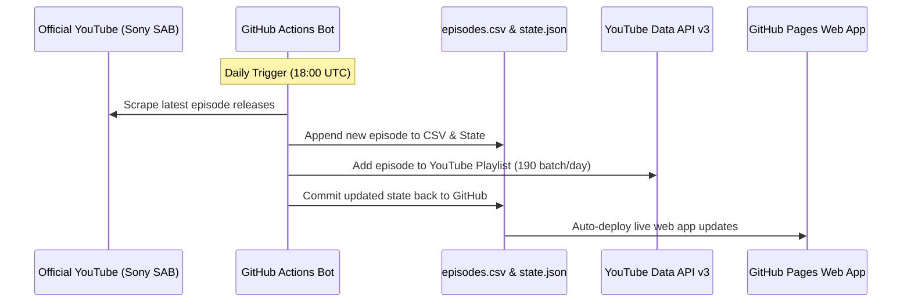

<div align="center">
  <h1>Daily Dose of TMKOC 🚂</h1>
  <p>A premium, blazing-fast, serverless video aggregator & YouTube playlist sync bot powered entirely by GitHub Pages & Actions.</p>

  <a href="https://github.com/CodeMasterAbhishek/tmkoc-youtube-playlist-bot/actions/workflows/daily_sync.yml">
    
  </a>
  <a href="https://CodeMasterAbhishek.github.io/tmkoc-youtube-playlist-bot/">
    
  </a>
  <a href="https://opensource.org/licenses/MIT">
    
  </a>

  <h3><a href="https://CodeMasterAbhishek.github.io/tmkoc-youtube-playlist-bot/">🌐 View Live Website</a></h3>
</div>

---

## Project Overview

**Daily Dose of TMKOC** is a modern **GitOps-driven video application** and YouTube playlist manager. 

Instead of paying for backend servers or risking third-party rate limits, this project uses GitHub Actions to automate episode discovery, state tracking, and YouTube playlist syncing. It compiles all 4,500+ episodes into a static dataset (`episodes.csv`) served globally via GitHub Pages CDN.

1. **Automated Scraping & Sync Engine:** Runs daily via GitHub Actions to detect newly released episodes (Sony SAB / Sony PAL) and append them to the master database.
2. **Auto-Populating Playlist Bot:** Gradually populates past episodes into the official YouTube Playlist (`PLLzj-79gxIKM`) at a rate of 190 videos/day under API quota constraints.
3. **Glassmorphic UI & Custom Video Player:** Features a custom HTML5/YouTube IFrame video player with Play/Pause, Seek bar, Speed selector (0.75x – 2.0x), Fullscreen, and Episode Navigation.

---

## Features

- ** Custom Video Player:** Interactive player modal with seek scrubbing, volume/fullscreen, playback speed control (0.75x to 2x), and Next/Prev episode buttons.
- ** Modern Glassmorphism UI:** Clean light/dark mode switcher, featured hero carousel, and era category filter pills (`Classic`, `Golden`, `Modern`, `Recent`).
- ** 100% Serverless & Free:** Hosted entirely on GitHub Pages CDN with $0 operational cost.
- ** Automated Daily Sync Bot:** Runs every night at 18:00 UTC (11:30 PM IST) to search for new daily episodes.
- ** 4,500+ Episode Database:** Pre-indexed dataset of all Taarak Mehta Ka Ooltah Chashmah episodes with zero missing data.

---

## Architecture Flow



---

## Project Structure

```text
tmkoc-youtube-playlist-bot/
├── .github/workflows/
│   └── daily_sync.yml          # GitHub Action scheduled daily cron
├── css/
│   ├── variables.css           # Design tokens & color themes
│   ├── layout.css              # Responsive grid & container layouts
│   └── style.css               # Main styling & Custom Player CSS
├── js/
│   ├── api.js                  # Data ingestion & CSV parser
│   ├── ui.js                   # DOM renderer & Custom Video Player Engine
│   └── app.js                  # App initialization, theme & event listeners
├── auto_update_playlist.py     # Main daily Python sync script
├── populate_daily_batch.py     # Past episodes batch populator script
├── episodes.csv                # Master dataset of all 4,500+ episodes
├── state.json                  # Last processed episode state tracker
├── index.html                  # Main web application entry point
└── README.md                   # Complete documentation
```

---

## Setup & Deployment

### 1. Clone Repository
```bash
git clone https://github.com/CodeMasterAbhishek/tmkoc-youtube-playlist-bot.git
cd tmkoc-youtube-playlist-bot
```

### 2. Configure GitHub Secrets
For automated YouTube Playlist updates, configure the following secrets under **Settings > Secrets and variables > Actions**:
- `YOUTUBE_CLIENT_ID`
- `YOUTUBE_CLIENT_SECRET`
- `YOUTUBE_REFRESH_TOKEN`
- `YOUTUBE_PLAYLIST_ID`

### 3. Enable GitHub Pages
- Go to **Settings > Pages**.
- Set Source to **Deploy from a branch**.
- Select branch `main` and folder `/ (root)`.
- Save — your website will be live at `https://<username>.github.io/<repository>/`!

---

## License
This project is licensed under the MIT License — see the [LICENSE](LICENSE) file for details. Video content rights belong exclusively to Sony SAB / Sony PAL / Sony LIV.
