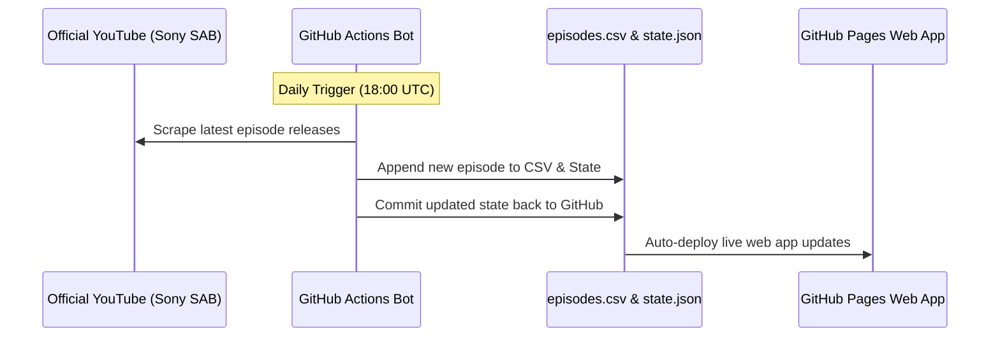

<div align="center">
  <h1>Daily Dose of TMKOC 🚂</h1>
  <p>A fast, serverless web application that aggregates all episodes of Taarak Mehta Ka Ooltah Chashmah, powered entirely by GitHub Pages and Actions.</p>

  <a href="https://github.com/CodeMasterAbhishek/Daily-Dose-of-TMKOC/actions/workflows/daily_sync.yml">
    
  </a>
  <a href="https://CodeMasterAbhishek.github.io/Daily-Dose-of-TMKOC/">
    
  </a>
  <a href="https://opensource.org/licenses/MIT">
    
  </a>

  <h3><a href="https://CodeMasterAbhishek.github.io/Daily-Dose-of-TMKOC/">🌐 View Live Website</a></h3>
</div>

---

## What is this?

**Daily Dose of TMKOC** is a web app built to organize and stream all 4,500+ episodes of the show *Taarak Mehta Ka Ooltah Chashmah*. 

Instead of dealing with backend servers or databases, I built this project to run completely for free using [GitHub Actions](https://github.com/features/actions) for automation and [GitHub Pages](https://pages.github.com/) for hosting. The app automatically looks for new episodes uploaded by Sony SAB on YouTube every day, updates a simple `.csv` file, and pushes the changes live to the website.

### How it's built
- **Frontend:** Built with plain [HTML](https://developer.mozilla.org/en-US/docs/Web/HTML), [Vanilla CSS](https://developer.mozilla.org/en-US/docs/Web/CSS), and [Vanilla JavaScript](https://developer.mozilla.org/en-US/docs/Web/JavaScript). No heavy frameworks like React or Vue.
- **Backend/Automation:** A lightweight Python script powered by [scrapetube](https://github.com/dermasmid/scrapetube) runs daily on GitHub Actions to scrape YouTube for new episodes. 
- **Database:** All episode data is stored in a static `episodes.csv` file, making it incredibly fast to load globally via GitHub's CDN.

---

## Features

- **Custom Video Player:** I built a custom player on top of the [YouTube IFrame API](https://developers.google.com/youtube/iframe_api_reference). It supports scrubbing, volume controls, fullscreen, playback speed (0.75x to 2x), and easy Next/Prev episode navigation.
- **Clean UI:** A modern interface with a light/dark mode switcher, a featured carousel, and a section for curated "Storylines" (multi-episode arcs).
- **Smart Caching:** To keep the site fast and avoid hitting YouTube too often, the app uses `localStorage` to cache which videos are available in your region. If you change your location (like connecting to a VPN), the site automatically detects your new IP address using [ipify](https://www.ipify.org/) and refreshes the cache so you can watch unlocked videos instantly.
- **Zero Running Costs:** Because everything is hosted on GitHub Pages and Actions, the project costs $0 to maintain.

---

## How the Automation Works



---

## Project Structure

```text
Daily-Dose-of-TMKOC/
├── .github/workflows/
│   └── daily_sync.yml          # GitHub Action scheduled daily cron
├── css/
│   ├── variables.css           # Design tokens & color themes
│   ├── layout.css              # Responsive grid & container layouts
│   └── style.css               # Main styling & Custom Player CSS
├── js/
│   ├── api.js                  # Data ingestion & CSV parser
│   ├── ui.js                   # DOM renderer & Custom Video Player Engine
│   └── app.js                  # App initialization, theme & event listeners
├── episodes.csv                # Master dataset of all 4,500+ episodes
├── state.json                  # Last processed episode state tracker
├── index.html                  # Main web application entry point
└── README.md                   # Complete documentation
```

---

## Setup & Deployment

If you want to run your own version of this:

### 1. Clone the Repository
```bash
git clone https://github.com/CodeMasterAbhishek/Daily-Dose-of-TMKOC.git
cd Daily-Dose-of-TMKOC
```

### 2. Enable GitHub Pages
- Go to your repository **Settings > Pages**.
- Set the Source to **Deploy from a branch**.
- Select the `main` branch and the `/ (root)` folder.
- Save the settings. Your website will be live at `https://<username>.github.io/<repository>/` in a few minutes!

---

## License
This project is licensed under the MIT License — see the [LICENSE](LICENSE) file for details. Note that all video content rights belong exclusively to Sony SAB, Sony PAL, and Sony LIV.
