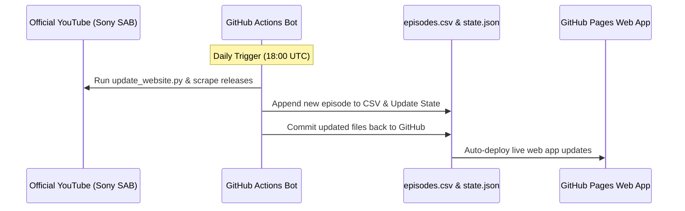

<div align="center">
  <h1>Daily Dose of TMKOC 🚂</h1>
  <p>A fast, serverless web application that aggregates all episodes of Taarak Mehta Ka Ooltah Chashmah, powered entirely by GitHub Pages and Actions.</p>

  <a href="https://github.com/CodeMasterAbhishek/Daily-Dose-of-TMKOC/actions/workflows/daily_sync.yml" target="_blank" rel="noopener noreferrer">
    
  </a>
  <a href="https://CodeMasterAbhishek.github.io/Daily-Dose-of-TMKOC/" target="_blank" rel="noopener noreferrer">
    
  </a>
  <a href="https://opensource.org/licenses/MIT" target="_blank" rel="noopener noreferrer">
    
  </a>

  <h3><a href="https://CodeMasterAbhishek.github.io/Daily-Dose-of-TMKOC/" target="_blank" rel="noopener noreferrer">🌐 View Live Website</a></h3>
</div>

---

## 📖 What is this?

**Daily Dose of TMKOC** is a serverless web application built to organize and stream all 4,500+ episodes of the iconic Indian sitcom *Taarak Mehta Ka Ooltah Chashmah*. 

Instead of relying on expensive backend servers, databases, or the restricted YouTube Data API, this project runs **100% for free** using GitHub Actions and GitHub Pages. A custom Python automation script natively scrapes YouTube for newly uploaded episodes daily, updates a flat-file CSV database, and deploys the new data live.

---

## 🛠️ How It's Built

- **Frontend:** Built completely with pure HTML5, Vanilla CSS, and Vanilla JavaScript. No heavy frontend frameworks to ensure maximum performance and lightweight footprint.
- **Backend/Automation:** A Python script (`update_website.py`) powered by `scrapetube` and `requests`. It runs daily via GitHub Actions to fetch the latest episodes without consuming any YouTube API quotas.
- **Database (Zero-cost DB):** Episode metadata is stored in static files (`episodes.csv`, `state.json`, `storylines.json`). This architecture leverages GitHub's CDN to serve data lightning fast across the globe.

---

## ✨ Features

- **Custom Video Player:** A bespoke player built on top of the YouTube IFrame API. Features include:
  - Custom scrubbing and progress bar.
  - Volume controls and fullscreen mode.
  - Playback speed adjustment (0.75x to 2x).
  - Seamless Next/Previous episode navigation.
- **Curated "Storylines":** Dedicated section leveraging `storylines.json` to organize multi-episode arcs for binge-watching specific plots.
- **Modern UI/UX:** Responsive interface featuring a Light/Dark mode switcher, smooth transitions, and a featured episode carousel.
- **Smart Geo-Caching:** Uses `localStorage` alongside the `ipify` API to cache region-specific video availability. If a user connects to a VPN or changes locations, the app automatically detects the new IP and refreshes the cache for instant access to unlocked videos.
- **$0 Running Costs:** Completely hosted and automated on GitHub's ecosystem.

---

## ⚙️ How the Automation Works

The daily synchronization process is fully automated.



---

## 📁 Project Structure

Here is an overview of the codebase:

```text
Daily-Dose-of-TMKOC/
├── .github/workflows/
│   └── daily_sync.yml          # GitHub Action for the daily automated cron job
├── css/
│   ├── layout.css              # Responsive grid & container layouts
│   ├── style.css               # Main styling & Custom Video Player UI
│   └── variables.css           # Design tokens & color themes
├── js/
│   ├── api.js                  # Data ingestion & CSV parsing logic
│   ├── app.js                  # App initialization, theme toggler, and core event listeners
│   └── ui.js                   # DOM rendering & Custom Video Player Engine (incl. ipify)
├── episodes.csv                # Master dataset containing all 4,500+ episodes
├── index.html                  # Main web application entry point
├── README.md                   # Project documentation
├── requirements.txt            # Python dependencies for the automation script
├── state.json                  # Tracks the latest processed episode state
├── storylines.json             # Structured data for multi-episode arcs
└── update_website.py           # Python scraper and database updater
```

---

## 🚀 Setup & Deployment

Want to deploy your own instance?

### 1. Clone the Repository
```bash
git clone https://github.com/CodeMasterAbhishek/Daily-Dose-of-TMKOC.git
cd Daily-Dose-of-TMKOC
```

### 2. Run Automation Locally (Optional)
If you want to manually update the episode database:
```bash
pip install -r requirements.txt
python update_website.py
```

### 3. Enable GitHub Pages
- Navigate to your repository's **Settings > Pages**.
- Under **Build and deployment**, set the Source to **Deploy from a branch**.
- Select the `main` branch and the `/ (root)` directory.
- Click **Save**. Your website will be live at `https://<username>.github.io/<repository>/` shortly!

---

## 📄 License

This project is open-source and licensed under the <a href="LICENSE" target="_blank" rel="noopener noreferrer">MIT License</a>. 
*Note: All video content, characters, and trademarks belong exclusively to Sony SAB, Sony PAL, Sony LIV, and Neela Tele Films.*
